# bash_vault

Combination of Cryptsetup+Zenity+Bash to created an encrypted Vault , with some extra perks !!

## Pre-requisite

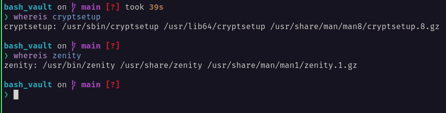

## Please wait while README gets updated 

While i do that, note Modify Password is something am still testing, it's really complex and so don't use it right now

## Configuration

There is nothing to configure as of now except

1. **MAX_VAULT_SIZE** by default on line #6 of the file, it's **30** ( *as in 30GB*), you can change it to whatever you seem fit
2. **VAULT_FOLDER** by default on line #7 it's **.vaults** which equated to ``` /home/user/.vaults ```, to change it to ``` /home/user/secret/whatever ``` change line #7 to **VAULT_FOLDER="secret/whatever"** , make sure folder name ``` whatever ``` doesn't exist

## Why This?

1. Easy to implement, doesn't require any other program which already doesn't come installed on many distro except zenity 
2. Here my "Homework" vault is 20GB (which can be extended to maximum depending upon **MAX_VAULT_SIZE**) If i have to backup it, I need to copy just 1 file which is 20GB, in contrast to gocryptfs where there are so many files and it slows down my backup speed.

## Why Shouldn't I use it? 

1. Every vault is secured with a password, you lose it and you lose the vault :"( 
2. If gocryptfs/any other encrypted software works for you, then don't fix what isn't broke ( although would love to see people trying this out)
3. Can't decrease the size of vault, only can increase it ( but there is a workaround )

## Walk me through these Zenity prompts?

1. Always your first prompt! Enter your sudo password. Why? Requires access to /dev/mapper to mount devices, you will be asked for sudo once during whole script lifecycle , to avoid any annoyance <3
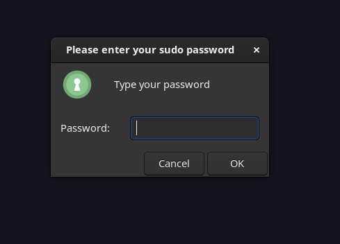  

2. What should script do next? 
    - If **VAULT_FOLDER** was not present , You can choose how to create vault -> Using Password or Keyfile
     
     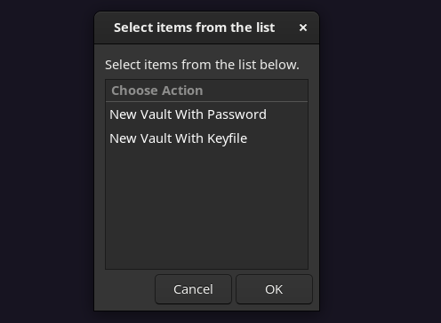 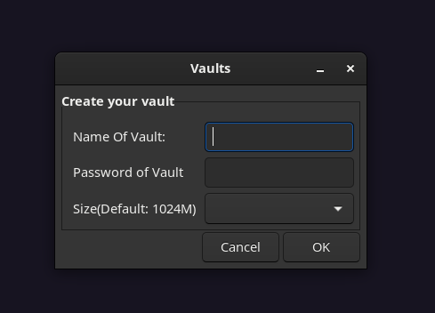 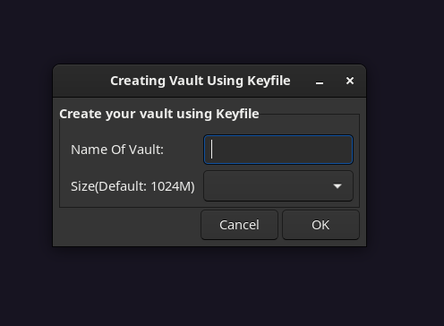 
     
    - If **VAULT_FOLDER** was present, and no vaults were found ( because you deleted it), if pressed yes, it will give prompt as above
    
     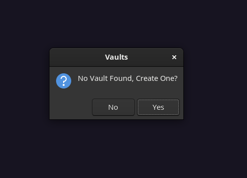
    
    - If **VAULT_FOLDER** was present, and there are more than 0 vaults (vaults end with .img) it asks you to choose action for certain vault, check [Understanding default prompt](#understanding-default-prompt) 
     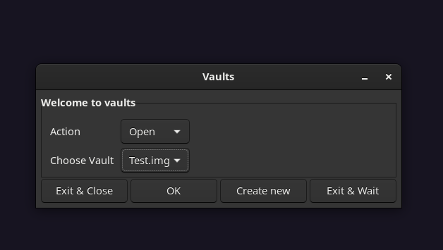

## Understanding default Prompt

### Understanding Buttons 

1. Exit And Close -> Script will exit , and close all vaults ( Pressing Esc button would do same)
2. Exit and Wait -> Script will wait in background . 
   - to make it exit 
    ``` echo closeall >> /home/$USER/<vault_folder>/pipe/m_pipe ```<br>
    default ``` echo closeall >> /home/$USER/.vaults/pipe/m_pipe ```

   - to show default prompt again 
    ``` echo okay >> /home/$USER/<vault_folder>/pipe/m_pipe ```<br>
    default ``` echo closeall >> /home/$USER/.vaults/pipe/m_pipe ```

3. Create New -> Create new vault 
4. Okay button -> Takes input of Action and Vault, if no valid Action/Vault is provided, gives error

### Understanding Action 

1. Open -> 
  - If Keyfile is disabled in "Modify Passowrd" section, Or if vault was created with password
      Asks for password of said vault and mounts it in **VAULT_FOLDER/VAULT_NAME.data**, and then xdg-open it 
  - If Keyfile is enabled in "Modify Passowrd" section, Or if vault was created with keyfile
      Asks for user to select a keyfile and mount vault in **VAULT_FOLDER/VAULT_NAME.data**, and then xdg-open it 
2. Close -> If vault is open then close it 
3. Rename -> Rename Your vault
4. Modify Passowrd -> [It deserve a section of it's own](#understanding-modify-password)
5. Delete -> Close vault if opened and then proceed to delete it 
6. Extend -> Show a scale between current SIZE of vault and **MAX_VAULT_SIZE** , ask user to choose 

### Understanding Modify Password

LUKS provide keyslots to add Passphrases which can come from 2 source 

1. A password 
2. A keyfile 

LUKS internally doesn't discriminate between these 2, but gives user choice to use whatever seems fit 
Opening this section you see either of these 2 prompts 

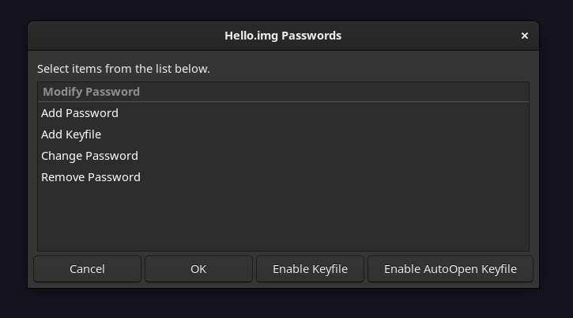
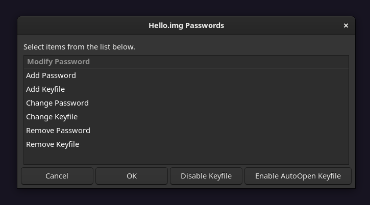

1. **Enable Keyfile** button -> Enable keyfile as default vault opening behaviour for selected vault ( If you don't have keyfile added add it first)
2. **Disable Keyfile** button -> Disable keyfile as default vault opening behaviour for selected vault ( If you don't have password added add it first)

In either of above cases you will prompt informing you to add password/keyfile, no data will be lost in enabling or disabling them, it's just default way to handle it 
you can come back and toggle it back to what you want.

**Coming to options**

1. Add Passowrd -> Password can be added by unlocking the vault **using default unlock method** and then entering a new Passowrd 
2. Add Keyfile -> Keyfile can be added by unlocking the vault **using default unlock method** and then selecting a new keyfile
3. Change Password -> Password can be changed by unlocking the vault using **any added password to be changed**  and then entering new password
4. Change Keyfile (Only shown if you have enabled keyfile)-> Keyfile can be changed by unlocking the vault **using another keyfile to be removed** and then selecting a new keyfile
5. Remove Password -> Password can be REMOVED by unlocking the vault using **password to be removed**, **IF YOU HAVE NO OTHER PASSWORD OR KEYFILE ADDED, YOU LOSE ALL DATA**
6. Remove Keyfile (Only shown if you have enabled keyfile)-> Keyfile can be REMOVED by unlocking the vault **using keyfile to be removed**,**IF YOU HAVE NO OTHER PASSWORD OR KEYFILE ADDED, YOU LOSE ALL DATA**

## In case of error/success Strings are updated and are shown here

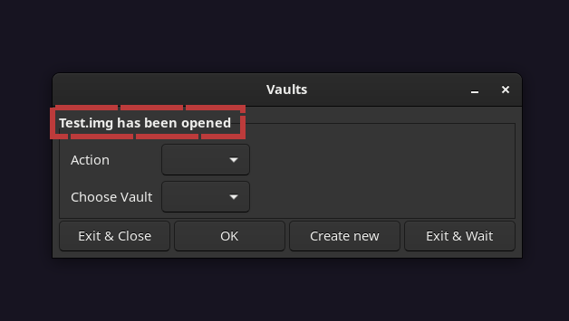

## What If

1. I ran bash_vault.sh from Terminal, What if Ctrl+C it, Do Vault Remain Open?? What happens?
   <br>
   No, signal like SIGINT is trapped and is used to close all vaults before exiting.
2. I am copying data to vault and i force closed it, what happens to my data? 
   <br>
   Depends on resilience of ext4 itself
3. I like how it works but my work is around one vault only, I don't need many :"( <br>
   <br>
   This is where power of scripting comes in , and you can use keybinding for that.
   For example in following script you can toggle mount by running it 
    ```bash 
    #!/bin/bash
    VAULT="testing.img"  # Remember to put .img here at end, Set your default vault  
    SCRIPT_LOCATION="/home/$USER/bash_vault/bash_vault.sh" #Location of your bash_vault script 
    VAULT_FOLDER=".vaults" #Change it only if you have changed default in script 
   
    USER_R=$USER
    FOLDER="/home/$USER/$VAULT_FOLDER"
    PIPE="$FOLDER/pipe/m_pipe"
    V_PIPE="$FOLDER/pipe/$VAULT"
     
    if [ -p $V_PIPE ]; then 
        echo "Closing vault"
        echo close >> $V_PIPE 
    else
       PASS=$(zenity  --password --title="Enter Sudo Password") 
       echo $PASS | sudo -E -S $SCRIPT_LOCATION $USER_R $VAULT
    fi
    ```
## Demonstration 

Right-Click on these gif and click "Open Image in New tab" to view them properly

1. Creating a new vault , and you can see force exit will close all mounts ( and so will rebooting your system)


2. Extending the newly created vault from 1GB to 5GB 
   
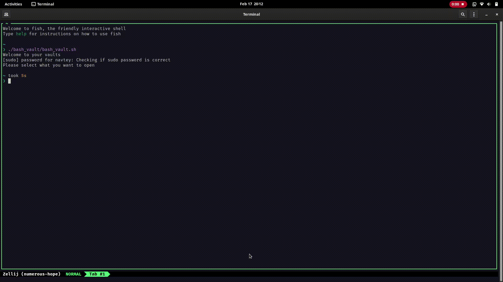

3. Closing the vaults using script or zenity window

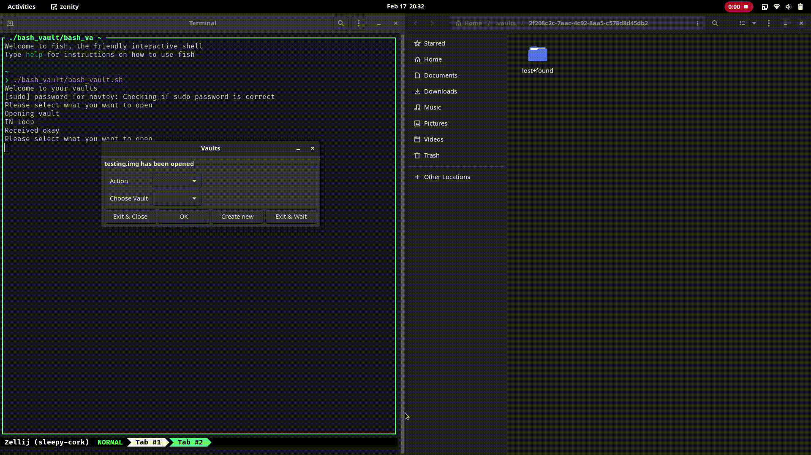

4. Demonstration of my setup where bash_vault is bound to ALT+SHIFT+V `sh -c "~/bash_vault/bash_vault.sh"`


5. Demonstration of script mentioned in [What if](#what-if) section, which toggles mount of `testing.img` Vault on my machine

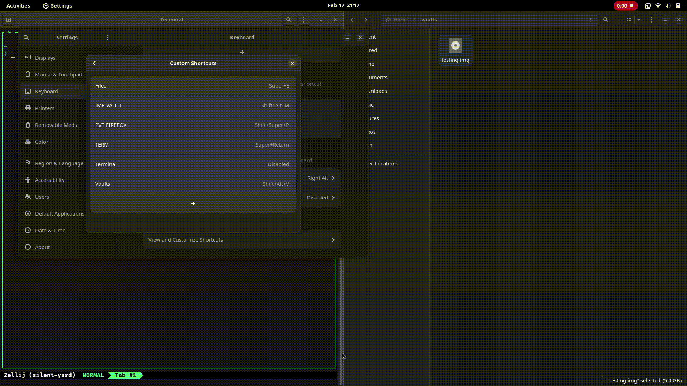

Donations? , [PayPal](https://paypal.me/TalentedTey?locale.x=en_GB)
Suggestions? , [Signal](https://signal.me/#p/+919519873721)
